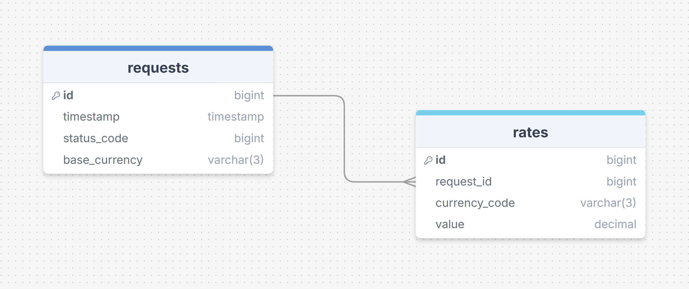

# Currency Tracker Service

Сервис для автоматического мониторинга курсов валют. Проект собирает данные из внешнего API, обрабатывает их и сохраняет в реляционную базу данных PostgreSQL.

API: https://www.exchangerate-api.com/

## 🛠 Стек
*   **Язык:** Python 3.11 (библиотека `requests` для API)
*   **База данных:** PostgreSQL (библиотека `SQLAlchemy 2.0` с использованием `Mapped` типов)
*   **Инфраструктура:** Docker, Docker Compose
*   **Конфигурация:** `python-dotenv` для хранения секретов
*   **Логирование:** Стандартная библиотека `logging` (раздельные файлы для INFO и ERROR + вывод логов в консоль)

## 📊 Архитектура базы данных
БД состоит из двух связанных таблиц с использованием `ForeignKey`:

1.  **requests** - хранит метаданные каждого запроса к API (ID, время, HTTP статус-код, базовая валюта).
2.  **rates** - хранит конкретные значения курсов валют, привязанные к ID запроса.



## 🚀 Как запустить проект

1.  **Клонировать репозиторий:**
    ```bash
    git clone https://github.com/dashdash27/rate-tracking-system.git
    cd rate-tracking-system
    ```

2.  **Настроить переменные окружения:**  
 Создать файл `.env` на основе примера:
    ```bash
    # Для macOS / Linux / PowerShell:
    cp .env.example .env
    
    # Для Windows (CMD):
    copy .env.example .env
    ```
    *Обязательно укажите API-ключ `EXCHANGE_RATE_API_KEY` в созданном файле. Его можно получить бесплатно на сайте https://www.exchangerate-api.com/*
3.  **Запустить контейнеры:**
    ```bash
    docker-compose up --build
    ```
    После запуска сервис начнет опрашивать API с заданным интервалом (по умолчанию - каждые 5 минут).

### 🔑 Примечание
В `docker-compose.yml` настроен проброс внешнего порта для бд (чтобы не было конфликтов с запущеным PostgreSQL, у которого стандарт 5432):
*   **Внешний порт:** `5435` (можно использовать для подключения через pgAdmin).
*   **Внутренний порт:** `5432` (внутри Docker-сети).


## 🔍 SQL-запрос для выгрузки данных (JOIN)

Запрос, который объединяет таблицы и выгружает историю запросов вместе с полученными значениями валют:

```sql
SELECT 
    r.id AS request_no,
    r.timestamp,
    r.status_code,
    rt.currency_code,
    rt.value AS rate
FROM 
    requests r
JOIN 
    rates rt ON r.id = rt.request_id
ORDER BY 
    r.timestamp DESC;
```
